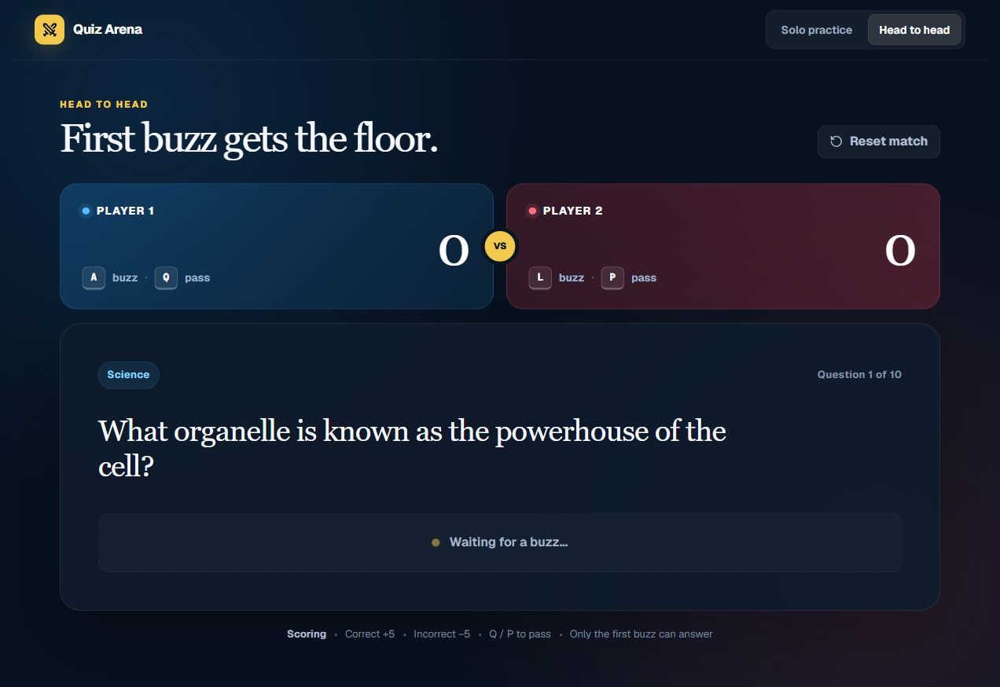

# Quiz Arena



An academic team practice app with solo quizzes and two-player buzzer matches in the same browser. Ten sample questions cover science, history, literature, mathematics, geography, and art.

## How to play

**Solo practice:** Type an answer and check it before moving to the next question. Correct answers earn 10 points; incorrect answers lose 5.

**Head-to-head:** Player 1 presses **A** to buzz or **Q** to pass. Player 2 presses **L** to buzz or **P** to pass. Only the first player to buzz can answer. Correct answers earn 5 points; incorrect answers lose 5. When both players pass, the next question appears with no score change.

Scores last for the current session. Use **Reset match** to start a new head-to-head game.

## Try it locally

Install Node.js 22.13.0 or later, then run these commands from the project folder:

```sh
npm ci
npm run dev
```

Open the local address printed in the terminal.

## About the project

I built the solo and head-to-head modes, keyboard buzzer controls, pass actions, and scoring. The [version history](CHANGELOG.md) describes how the app developed.

Built with React and TypeScript using the OpenAI Sites starter, vinext, Tailwind CSS, Lucide icons, and shadcn/Base UI components. Credit for those tools and shared components belongs to their respective authors.
